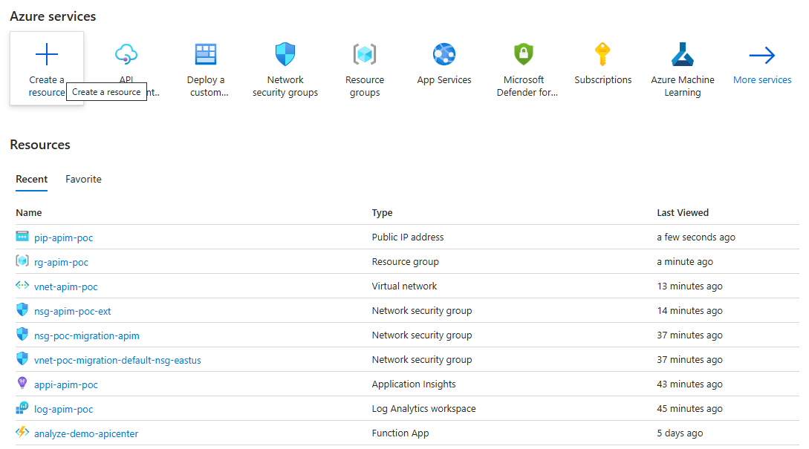
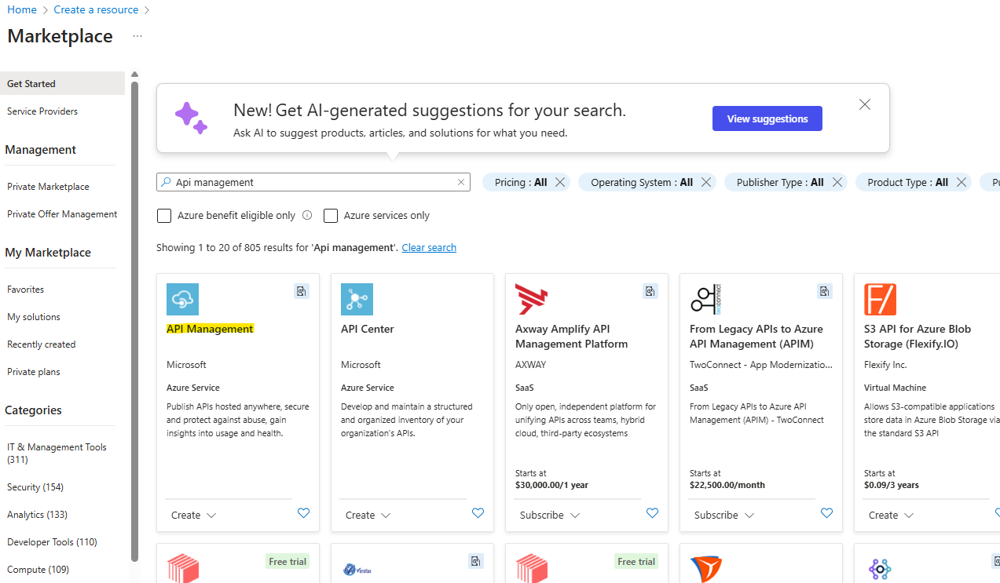
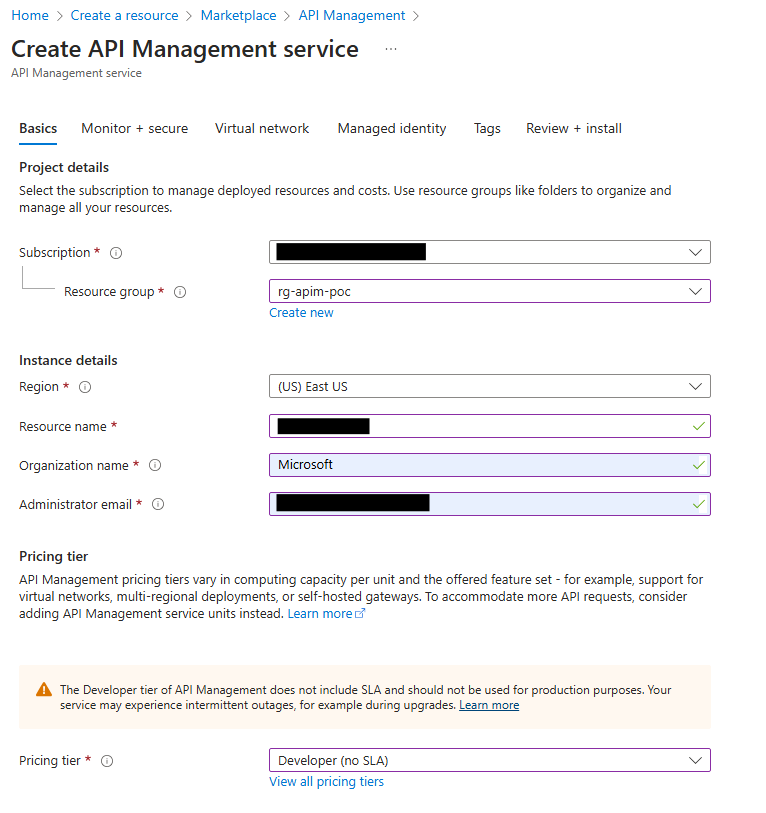
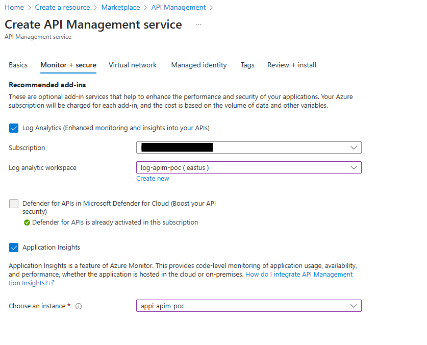
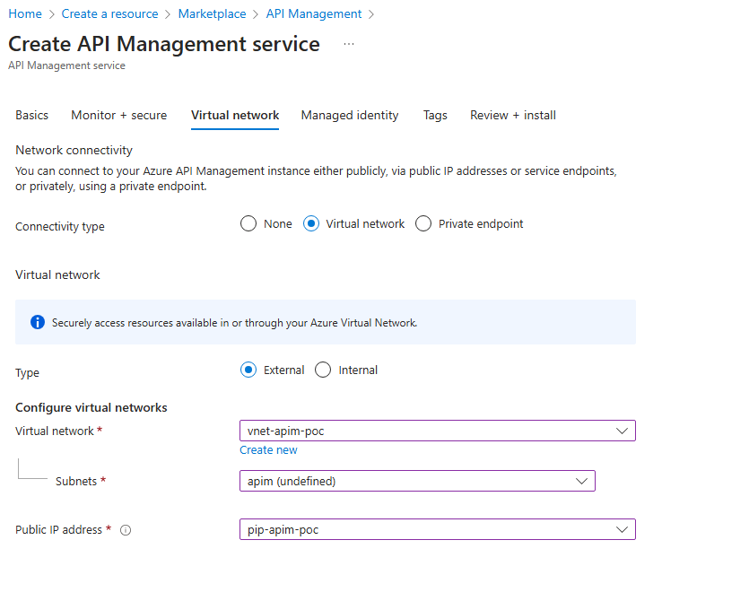
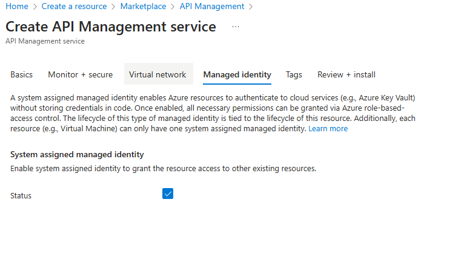

# Setup Azure API Management Service

## Prerequisites

- Administrative access to an *Azure Subscription*
- A *Resource Group* to deploy POC resources
- A *Log Analytics* Workspace for capturing metrics and logs
- An *App Insights* instance connected to that log analytics workspace
- A *Virtual Network* with at least 1 unused subnet available
    - The subnet used must have the appropriate [network security group](../attachments/nsg_ext_template.json) associated
- A *Public IP* for outbound routing and management plane traffic

## Create Instance

1. Navigate to the Azure Portal and select "Create a resource"

2. In the search box, search for "API Management" and hit enter to search the marketplace.  Select "API Management" from the list of services.

3. Click "Create" to initiate the creation wizard.
4. On the Basics tab, fill out the fields as documented in the table below:

| Field | Value |
| ----------- | ----------- |
| Subscription | Select the Azure Subscription you are working with (should be defaulted) |
| Resource group | Select the Resource Group created as part of the prerequisites |
| Region | Select the appropriate region for your resources |
| Resource name | Enter the name of your instance - this will be the URL prefix/subdomain |
| Organization name | Enter your organization's name |
| Administrator email | Enter your email address | 
| Pricing tier | Select "Developer".  We can scale up to Premium when needed. |

5. On the Monitor + secure tab, fill out the fields as documented in the table below:

| Field | Value |
| ----------- | ----------- |
| Log Analytics | Check the checkbox |
| Log analytic workspace | Select the workspace created as part of the prerequisites |
| Application Insights | Check the checkbox |
| Choose an instance | Select the instance created as part of the prerequisites |

6. On the Virtual network tab, fill out the fields as documented in the table below:

| Field | Value |
| ----------- | ----------- |
| Connectivity type | Select "Virtual network" |
| Type | Select "External" |
| Virtual network | Select the instance created as part of the prerequisites |
| Subnets | Select the API Management subnet created as part of the prerequisites |
| Public IP Address | Select the Public IP resources created as part of the prerequisites |

7. On the Managed identity tab, make sure the System assigned managed identity is enabled by checking the checkbox

8. Navigate to the Review + install tab.  This screen will validate all parameters. Once validated, click the blue "Create" button on the bottom left of the screen to create your instance.

9. API Management can take up to 45 minutes to provision.  You will receive an e-mail when the instance is ready.